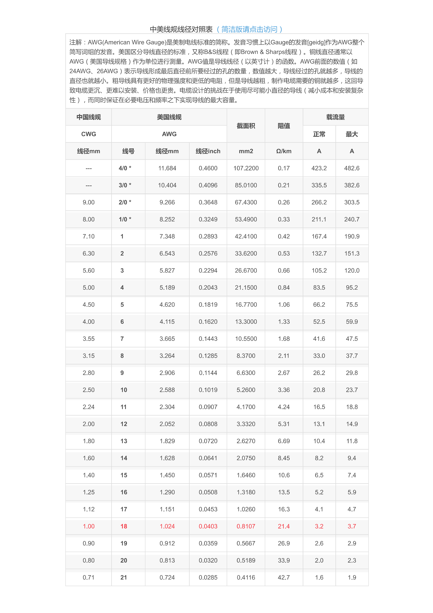
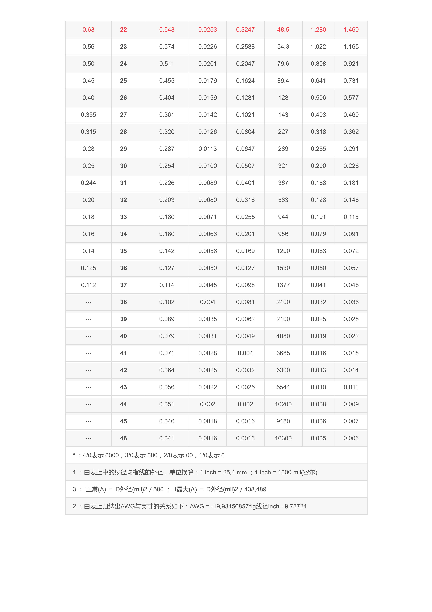

# 线规（Wire Gauge）笔记

> 做硬件时选电线常常靠感觉：电机该用多粗？信号线用多粗？    
> 这篇是我自己查资料和实测后整理的，方便以后选型。

## 1. 线规是什么

### 1.1 常用标准
线规是用来表示电线粗细的标准。常见的有：

- **AWG**（American Wire Gauge）：美国线规，数字越大线越细。比如 30AWG 很细，10AWG 很粗。
- **SWG**（British Standard Wire Gauge）：英国线规，用得少。
- **公制**（mm²）：直接标导体截面积，更直观。

国内工程常用**公制单位（mm²）**，这篇以截面积为核心，辅以 AWG 对照，用于快速选型和设计复查。

### 1.2 公制截面积与 AWG 对照表（铜芯）

| 截面积 (mm²) | 近似 AWG | 直径 (mm) | 每公里电阻 (Ω/km, 20°C) | 最大电流 (PVC, 短距) | 大致用途 |
|--------------|----------|-----------|--------------------------|----------------------|-----------|
| 0.05 | 30 | 0.255 | 339 | 0.5A | 细飞线、芯片引脚跳线、面包板跳线内芯 |
| 0.08 | 28 | 0.321 | 214 | 0.8A | 普通信号线、排线、杜邦线内部导体 |
| 0.13 | 26 | 0.405 | 135 | 1.3A | I2C/SPI 信号、小功率 LED、传感器线 |
| 0.20 | 24 | 0.511 | 84.2 | 2.1A | 一般控制信号、弱电电源（<1A） |
| 0.32 | 22 | 0.644 | 53.3 | 3.5A | 舵机线、小电机、板级电源线（2-3A） |
| 0.52 | 20 | 0.812 | 33.9 | 5.5A | 中型电机、电池接线、5A 级电源 |
| 0.82 | 18 | 1.024 | 21.4 | 9A | 大舵机、电调输入线、10A 级电源 |
| 1.31 | 16 | 1.291 | 13.5 | 13A | 动力电池主回路、15A 级设备 |
| 2.08 | 14 | 1.628 | 8.45 | 18A | 较大功率电机、逆变器输入线 |
| 3.31 | 12 | 2.053 | 5.31 | 25A | 航模动力线、电调-电池连接 |
| 5.26 | 10 | 2.588 | 3.34 | 35A | 汽车音响、大功率电源输出 |

> 注意：
>&emsp;载流量与线材材质（纯铜、铜包铝）、绝缘耐温、线长、散热条件有关。上表是**短距离（<1m）、单根、空气中、PVC绝缘**的大概值。
>&emsp;保险起见，按表中数值的 70-80% 使用更安全。

以上参考了CSDN博主[WindChimes](https://blog.csdn.net/Britripe/article/details/105264681)的作品

<!--  -->

---

## 2. 载流量影响因素（工程选型要点）

| 因素 | 影响 | 工程处理 |
|------|------|----------|
| 线长 | 越长压降越大，发热累积 | 长距离（>2m）按表降一档或两档 |
| 多线并排 | 散热变差 | 捆扎线束按表中 60-70% 使用 |
| 环境温度 | 高温降低载流能力 | 机箱内（>50°C）降额 20% |
| 绝缘材料 | 耐温越高允许电流越大 | PVC 80°C，硅胶 200°C（硅胶可提高 20-30%） |
| 铜纯度 | 铜包铝或杂质电阻高 | 只买正规品牌，测电阻验证 |

**我的经验**：按上表数值的 70% 使用，安全余量足够。

---

## 3. 实际项目中怎么选

### 信号线
- 传感器、I2C、UART、SPI：28-30AWG 就够了，比如杜邦线内部就是 26-28AWG。
- 注意：太长或大电流信号（如 4-20mA 电流环）要加粗。

### 电源线
- 小电流（<1A）：24-26AWG
- 电机、舵机（1-3A）：22AWG
- 电池到电调（5-10A）：18-20AWG
- 电池到电调（10-20A）：16-14AWG
- 启动电机、加热器（20-40A）：12AWG 或更粗

### 经验口诀
- 1A 以下：26AWG 足够
- 2-3A：22AWG
- 5A 左右：20AWG
- 10A 左右：18AWG
- 20A 左右：14-12AWG

## 4. 常见线材类型（绝缘层）

| 类型 | 特点 | 适用场景 |
|------|------|----------|
| PVC 电子线（如 1007、1015） | 便宜、硬、耐温 80°C | 一般电子设备内部接线 |
| 硅胶线 | 非常软、耐高温（200°C）、贵 | 航模、机器人、大电流场合 |
| PTFE（铁氟龙）线 | 耐高温、耐腐蚀、硬 | 工业、高温环境 |
| 排线（FFC/FPC） | 扁平、多芯 | 液晶屏、键盘连接 |
| 杜邦线（母对母/公对公） | 方便插拔，内部 26-28AWG | 实验、原型测试 |

**我的习惯**：  
- 实验板飞线：买成品杜邦线（便宜省事）。
- 自制线束：用 22AWG 硅胶线（软、好焊、耐烫）。
- 大电流（>10A）：用 16AWG 硅胶线或专用动力线。

## 5. 线径与电流的更多细节

### 影响载流量的因素
- **线长**：越长压降越大，长距离要加粗 1-2 号。
- **并线数量**：多根线捆在一起散热变差，载流量要打折。
- **环境温度**：机箱内部温度高，载流量降低。
- **绝缘材料**：硅胶线（200°C）比 PVC（80°C）能过更大电流。

### 压降估算（铜电阻率 ≈ 0.0175 Ω·mm²/m）
网上有一堆工具，自行搜寻“电压降计算器”即可。输入线长、截面积、电流，看看压降是否在可接受范围内（一般 <5%）。如果压降过大，考虑加粗一号线或增加并联线。

---

## 6. 工具与测量

- **线规测量板**（Wire Gauge Card）：金属板带孔，把线塞进去看对应 AWG。
- **游标卡尺**：测导体直径（剥掉绝缘层），然后查表。
- **简易方法**：和已知线规的线（比如杜邦线）对比粗细。

> 注意：剥开绝缘层后测**铜芯直径**，不是带皮的直径。多股线要测单根铜丝直径和股数，计算总截面积。

## 7. 多股线与单股线

| 类型 | 特点 | 适用 |
|------|------|------|
| 单股（实心） | 硬、易定型、焊接方便 | 面包板、固定布线 |
| 多股（绞合） | 柔软、耐弯折、高频趋肤效应好 | 移动部件、大电流、高频信号 |

我平时做机器人：**动力线用多股硅胶线**（耐弯折），**传感器信号线用单股或细多股**（无所谓）。

## 8. 颜色标准（仅参考）

| 颜色 | 常用含义 |
|------|----------|
| 红 | 正电源（VCC） |
| 黑 | 地（GND） |
| 黄/白 | 信号线 |
| 蓝 | 负电源（-V） |
| 绿/黄双色 | 保护地（PE） |

做实验时尽量按这个习惯，免得以后自己搞混。

## 9. 设计检查清单（项目中使用）

在 BOM 或设计笔记中，可以逐项确认：

- [ ] 电源线按最大电流选型，并留有 30% 余量。
- [ ] 信号线长度 >0.3m 时，考虑阻抗或屏蔽。
- [ ] 压降计算：关键器件（如舵机、无线电）供电端电压 > 最低工作电压。
- [ ] 不同电压等级的线束物理分隔（避免高压串入低压）。
- [ ] 线束捆扎时留足散热间隙，大电流线避免紧贴。
- [ ] 线头使用端子或镀锡，避免散丝短路。
- [ ] 在图纸或笔记中标注线规（mm²）和颜色。

---

## 10. 购买与储存建议

**常备清单**（推荐新手先买这些）：
- 0.32mm²（22AWG）硅胶线（红、黑各 10米）—— 最常用
- 0.82mm²（18AWG）硅胶线（红、黑各 5米）—— 大电流
- 0.13mm²（26AWG）彩色排线（10色，各 2米）—— 信号线
- 成品杜邦线（公对公、母对母、公对母各 40根）
- 热缩管（2mm、3mm、5mm）
- 端子：XT60（大电流）、2.54mm 杜邦端子、JST-XH

**储存方法**：
- 按截面积和颜色分开卷绕，用扎带或魔术贴固定。
- 贴上标签（例：0.32mm² 红 硅胶）。
- 避免阳光直射（硅胶线耐候性好，PVC 会老化）。

---

## 11. 我踩过的坑

| 现象 | 原因 | 解决方法 |
|------|------|----------|
| 舵机经常重启 | 线太细，压降大 | 改用 22AWG 硅胶线 |
| 电机转动时传感器读数乱跳 | 电机大电流干扰信号线 | 信号线和动力线分开走，或用屏蔽线 |
| 电池线发热严重 | 线径不够 | 换粗两号，或并一根同规格线 |

## 12. 快速选型表

| 电流 (A) | 线长 <0.5m | 线长 0.5-1m | 线长 1-2m | 推荐绝缘 |
|----------|------------|-------------|-----------|-----------|
| 0.5 | 0.08mm² (28) | 0.08mm² (28) | 0.13mm² (26) | 任意 |
| 1 | 0.13mm² (26) | 0.13mm² (26) | 0.20mm² (24) | 任意 |
| 2 | 0.20mm² (24) | 0.20mm² (24) | 0.32mm² (22) | PVC/硅胶 |
| 3 | 0.32mm² (22) | 0.32mm² (22) | 0.52mm² (20) | PVC/硅胶 |
| 5 | 0.52mm² (20) | 0.52mm² (20) | 0.82mm² (18) | 硅胶优先 |
| 8 | 0.82mm² (18) | 0.82mm² (18) | 1.31mm² (16) | 硅胶 |
| 12 | 1.31mm² (16) | 1.31mm² (16) | 2.08mm² (14) | 硅胶 |
| 15 | 2.08mm² (14) | 2.08mm² (14) | 3.31mm² (12) | 硅胶 |
| 20 | 3.31mm² (12) | 3.31mm² (12) | 5.26mm² (10) | 硅胶 |

> 括号内为近似 AWG，供参考。此表基于铜芯、单根、环境 30°C，已考虑一般压降。

---

## 13. 参考资源

- [AWG 标准表（维基百科）](https://en.wikipedia.org/wiki/American_wire_gauge)
- [在线压降计算器](https://www.calculator.net/voltage-drop-calculator.html)
- 以上网站可能因为墙进不去，可以看CSDN的[相关帖子](https://blog.csdn.net/Britripe/article/details/105264681?spm=1001.2014.3001.5506)
- 各线材厂家提供的载流表（例如：UL 1007、UL 1015 规格书）

## 14. 总结

- **选线三步法**：
1）确定电流 → 2）查载流表选初步截面积（mm²） → 3）计算压降，若超标则加粗一号。
- **优先硅胶线**（软、耐高温、易焊接）。
- **长距离或大电流**，用粗线或增加并联线。
- **记录踩坑**，不断更新自己的选型表。

> 这篇笔记会随着项目积累持续更新。如果你有实际案例或新坑，欢迎补充。
> 此外，这篇是我自己的笔记，不一定完全精确，但够平时选线用了。如果有更专业的需求，建议查厂商规格书或标准（如 IEC 60228）。

---

[END OF DOCUMENT]

